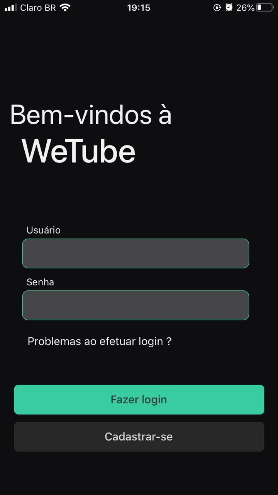
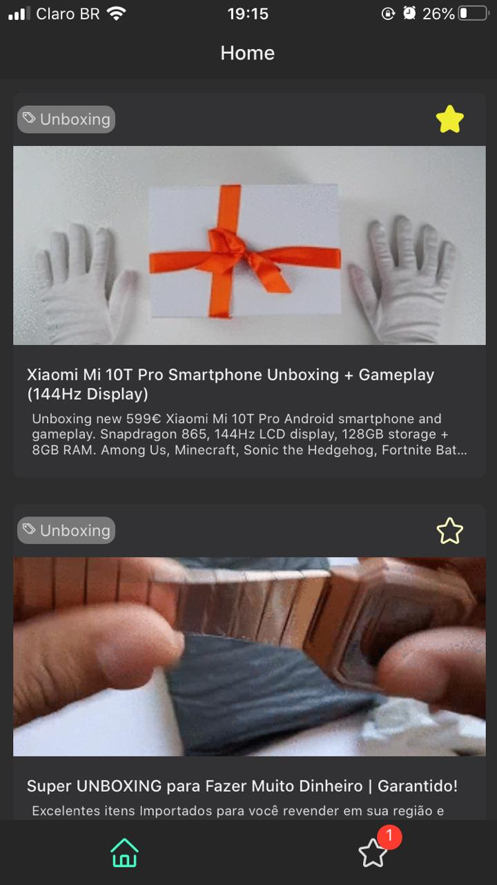
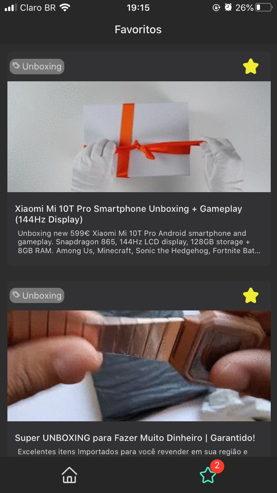

<h1 align="center">
  Desafio RN Globo
</h1>

 

  

    
    
    
  

 

## 📛 Tecnologias

Esse projeto foi desenvolvido com as seguintes tecnologias:

- React
- React-Native
- Expo
- Redux
- Styled Components

## 🏀 Projeto

Implementar um app mobile/protótipo que tenha uma tela de login e uma tela com um feed de vídeos.

O app pode ser 100% mockado, ou seja, a tela de login, basta clicar em um botão de ENVIAR para que seja visualizada a
tela de feed de vídeos.

A tela de feed de vídeos deve conter uma listagem de itens, com as seguintes informações:

- Imagem thumb do vídeo
- Título do vídeo
- Descrição do vídeo
- Tags do vídeo
- Opção de favoritar o vídeo
